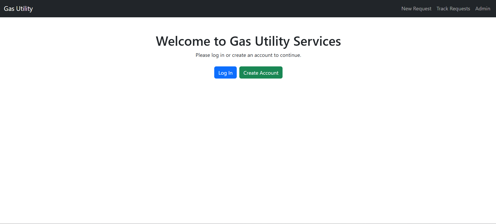

# Gas Utility Service Management System  

This is a Django-based web application designed to manage gas utility service requests. It includes two separate apps:  
1. **Customers**: Allows customers to sign up, log in, and submit service requests.  
2. **Customer Support**: Enables support staff to view, manage, and resolve service requests.  

The separation of these apps allows for future scalability with Docker and Kubernetes deployments.  

---

## Features  
- **Customer Portal**:  
  - Register and log in.  
  - Submit and track service requests.  


- **Support Portal**:  
  - View all customer requests.  
  - Update request statuses (e.g., resolve).  


- **Admin Panel**:  
  - Manage users and groups.  

---

## Prerequisites  
- Python 3.8 or later  
- Django 5.1.3  
- SQLite (default database)  

---

## Installation and Setup  

### 1. Clone the Repository  
```bash  
git clone https://github.com/your-username/gas-utility-service.git  
cd gas-utility-service  
```  

### 2. Create and Activate a Virtual Environment  
```bash  
python -m venv env  
source env/bin/activate  # On Windows: env\Scripts\activate  
```  

### 3. Install Dependencies  
```bash  
pip install -r requirements.txt  
```  

### 4. Apply Migrations  
```bash  
python manage.py migrate  
```  

### 5. Create a Superuser  
```bash  
python manage.py createsuperuser  
```  

### 6. Run the Development Server  
```bash  
python manage.py runserver  
```  

---

## Usage  

### Customer Actions  
1. Navigate to `http://127.0.0.1:8000/accounts/signup/` to register.  
2. Log in to the customer portal at `http://127.0.0.1:8000/accounts/login/`.  
3. Submit and track service requests.  

### Support Actions  
1. Log in to the support portal at `http://127.0.0.1:8000/support/manage/`.  
2. View, manage, and resolve customer service requests.  

---

## Preconfigured Login  

If you’re having trouble logging in, use the following credentials:  
- **Username**: `north`  
- **Password**: `viking1@`  

---

## Future Scalability  

This application is designed to support containerization and orchestration in the future.  
### Docker and Kubernetes Integration:  
1. **Apps Separation**: The `customers` and `customer_support` apps are modularized, allowing each app to run in its own container.  
2. **Service Deployment**: Kubernetes can be used to deploy the app as separate services, making it scalable and fault-tolerant.  

---


### Author  
Ajinkya Jadhav  
